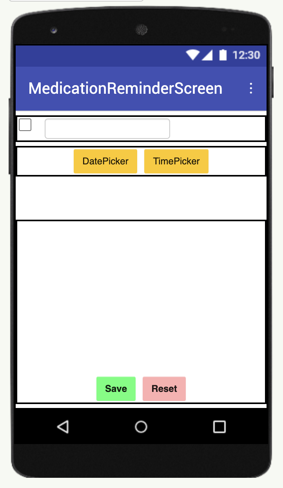

# Elderly Assistance App

## Introduction:

The Elderly Assistance Companion is a simple and user-friendly mobile app designed to support senior citizens in managing their daily tasks with ease. It helps them set medication reminders, schedule appointments, and make emergency call,share location, ensuring they never miss important activities.

With large buttons, voice alerts, and an emergency contact button, the app is built for easy navigation and accessibility. By integrating calendar scheduling and real-time reminders, it provides a sense of independence while keeping loved ones informed.

This app aims to enhance the quality of life for elderly individuals, reducing the risk of missed medications and appointments, and ultimately promoting better health and well-being.

## Screens1

In this screen user can select what service they want to use and click on it to access it.

button 1 for medication reminder

button 2 set daily task

button 3 for emergency

button 4 send live location to emergency contact(Now set for 911)

## Screen 2

## Screen 3

## Screen 4

##  Screen 5

## Block group 1

## Block group 2

## Block group 

## Block group 4

## Block group 5

## Known Bugs:

1. Event reminder screen not working properly
2. Location sending takes too much load, and typing half message only

## Features:

1. navigation works properly
2. emergency screen working perfectly
3. medication reminder screen working properly.
4. Used maps.
5. location sensor.
6. Tiny db
7. Date picker
8. Time Picker

## Refrence link

https://youtu.be/tem__cZCMsA?si=4QKNsdJnISqne05I

https://youtu.be/advx2kIg9ns?si=eqUrkf4y2ogZSEr5

https://youtu.be/i_JlWLjmxuM?si=LLIAa1UE-rn5WNz7

https://youtu.be/mg6KiAn9ny0?si=iuUoaiK16R5rW01p

https://youtu.be/bOgXG1tfuTM?si=DMan69w-1NpYT122

https://www.youtube.com/live/7ZlgxKa7epM?si=FmHBT7RJPNzCqYMv

